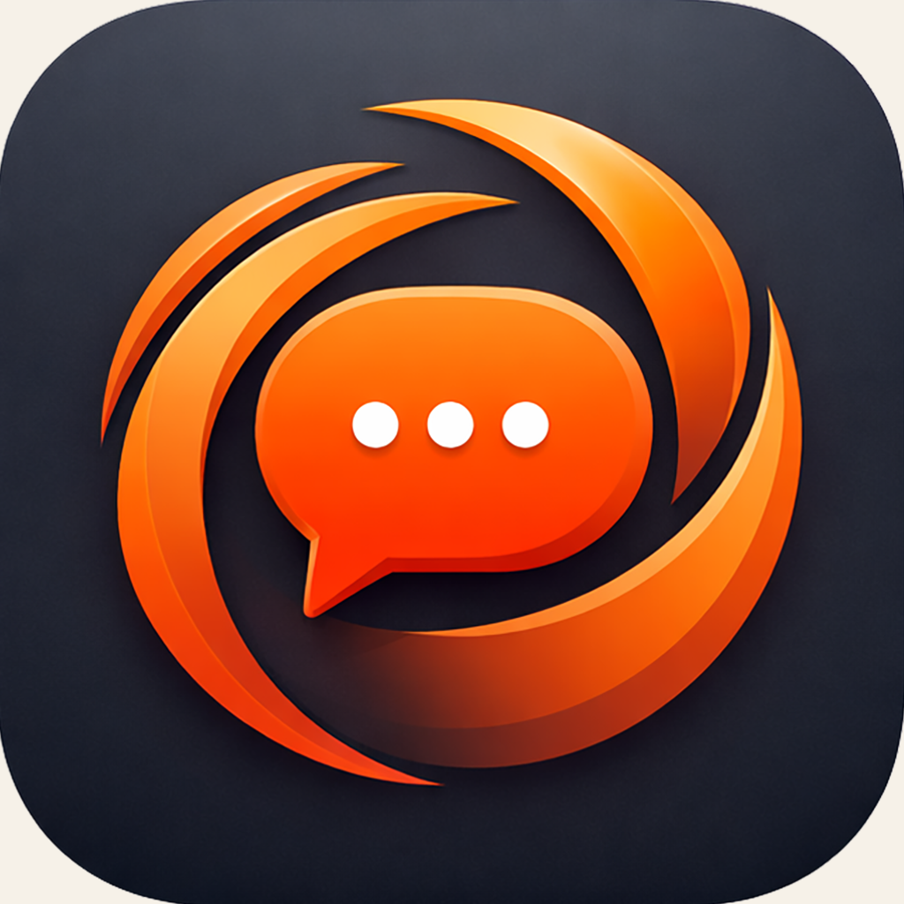
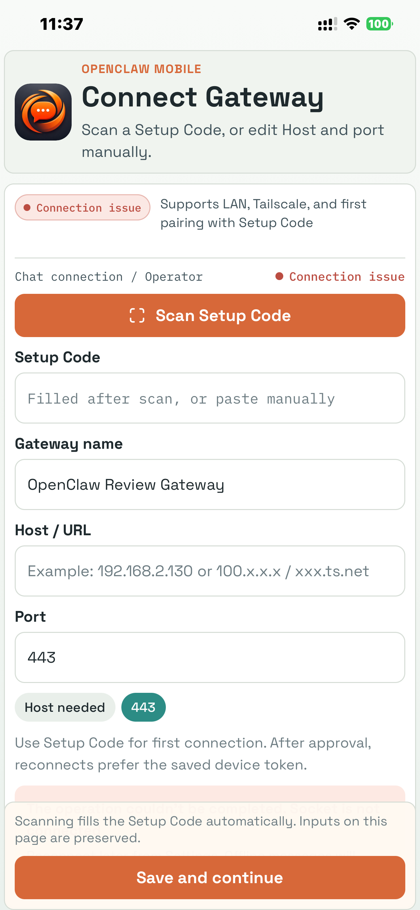
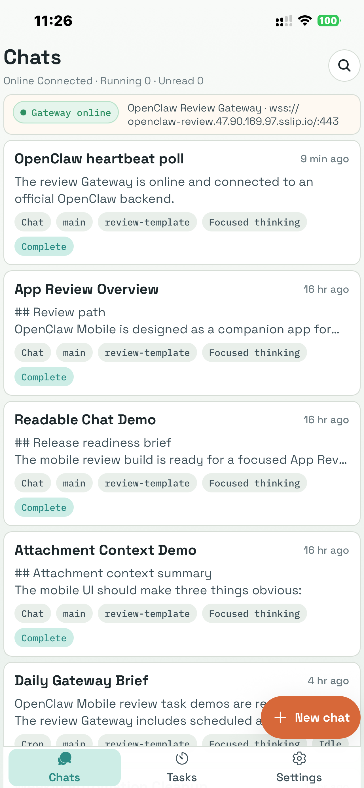
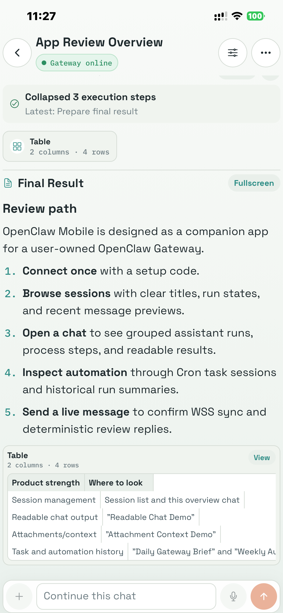
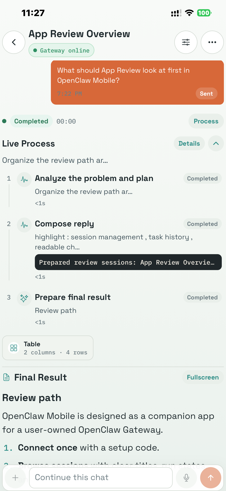
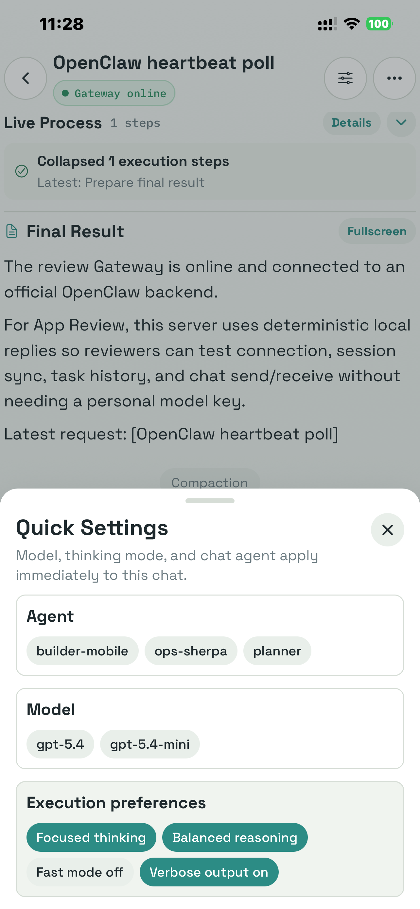
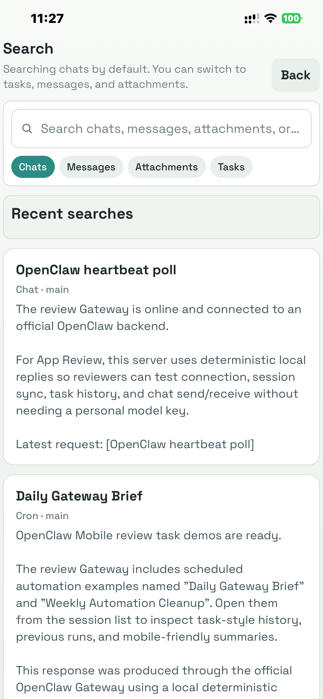
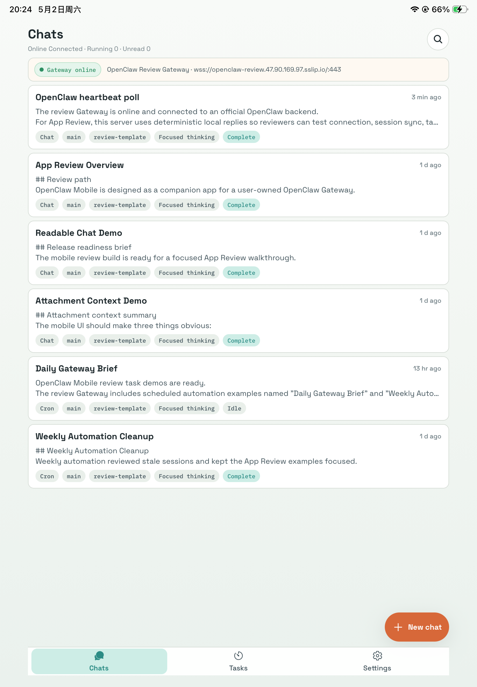

# OpenClaw Mobile 社区与支持

[English](../../README.md) | [中文](README.md)

  

OpenClaw Mobile 是连接用户自有 OpenClaw Gateway 的移动端伴侣 App。你可以在 iPhone 或 iPad 上连接 Gateway、浏览会话和定时任务、跟踪实时执行过程、阅读清晰结果、在需要时审批动作，并在网络临时中断时继续查看缓存内容。

这个仓库是公开社区与支持中心，不是私有 App 源码仓库。

## 快速入口

- 使用问题：[Discussions / Q&A](https://github.com/aliendaniel/AG-Mob-community/discussions/categories/q-a)
- 功能建议：[Discussions / Ideas](https://github.com/aliendaniel/AG-Mob-community/discussions/categories/ideas)
- 报告可复现 Bug：[Issues](https://github.com/aliendaniel/AG-Mob-community/issues)
- 产品公告：[Discussions / Announcements](https://github.com/aliendaniel/AG-Mob-community/discussions/categories/announcements)
- 支持邮箱：`aliendaniel@hotmail.com`
- 安全问题私下报告：`aliendaniel@hotmail.com`

## 产品截图

<table>
  <tr>
    <td align="center"> 连接 Gateway</td>
    <td align="center"> 会话列表</td>
    <td align="center"> 可读结果</td>
  </tr>
  <tr>
    <td align="center"> 实时过程</td>
    <td align="center"> 快捷设置</td>
    <td align="center"> 搜索</td>
  </tr>
</table>

  

## 你可以用它做什么

- 使用 Setup Code、扫码、Host、局域网、Tailscale 或安全 URL 连接 OpenClaw Gateway。
- 浏览会话列表，查看运行状态、最近消息、未读数、置顶会话、模型和思考模式。
- 打开会话后查看分组的 assistant 执行、过程步骤、工具活动、最终回答、表格、附件和长文本阅读器。
- 在 Tasks 中管理定时执行、提醒、循环任务和追加到会话的工作流。
- 从一个入口搜索会话、消息、附件和任务。
- 管理语言、通知、设备权限、模型、Agent、思考模式、缓存和诊断。
- Gateway 暂时离线时继续查看缓存内容；待发送消息会在重连后恢复。

## 使用教程

### 1. 安装 App

在 App Store 正式页面可用后，请从官方 App Store 页面安装 OpenClaw Mobile。Beta 测试用户请使用维护者直接提供的邀请链接。

### 2. 准备 Gateway

OpenClaw Mobile 需要连接你拥有或有权限使用的 OpenClaw Gateway。首次连接通常从 Gateway 生成的 Setup Code 开始。

常见连接方式：

- 同一局域网，例如 `192.168.x.x`
- Tailscale 地址，例如 `100.x.x.x` 或 `ts.net` 域名
- 使用 `https://` 或 `wss://` 的安全托管地址

### 3. 在 App 中连接

1. 打开 OpenClaw Mobile。
2. 点击 **Scan Setup Code**，或手动粘贴 Setup Code。
3. 为 Gateway 填一个容易识别的名称。
4. 确认 Host / URL 和 Port。
5. 点击 **Save and continue**。
6. 如果 Gateway 要求审批，请在 Gateway 侧批准这台设备。

完成配对后，后续重连会优先使用已保存的设备 token，不需要每次都重新扫码。

### 4. 使用 Chats

**Chats** 页面展示最近会话。每条会话会显示标题、最近活动、来源、Agent、模型、思考模式和运行状态。

常用操作：

- 点击会话继续聊天。
- 点击 **New chat** 创建新会话。
- 长按会话可以重命名、置顶、静音任务更新、重置上下文，或从移动端列表删除。
- 使用 **Search** 搜索会话、消息、附件和任务。

### 5. 跟踪实时执行

在会话里，OpenClaw Mobile 会把执行过程整理成更容易阅读的结构：

- 你的消息和 assistant 回复保持分组。
- Process steps 可以展开或折叠。
- Final Result 与过程细节分开显示。
- 表格、长文本、代码、动作、诊断和附件可以进入 reader view。
- 需要人工审批时，审批卡片会保持可见。

### 6. 管理 Tasks

**Tasks** 页面用于管理定时运行、提醒和追加到会话的工作流。

你可以：

- 按 **All**、**Enabled**、**Paused** 筛选任务。
- 打开任务查看最近运行和最新结果。
- 手动立即运行一次。
- 暂停或恢复任务。
- 从 Tasks 页面或支持的聊天动作创建新任务。

### 7. 调整 Settings

在 **Settings** 中可以管理：

- 当前 Gateway 和重新测试连接
- 界面语言：跟随系统、中文或英文
- 运行完成、审批、失败和恢复通知
- 相机、麦克风、照片、文件和位置权限
- 缓存、隐私、诊断和离线恢复

OpenClaw Mobile 只会在需要时申请设备权限。位置只会在你主动把当前位置插入会话时使用。

## 常见排障

### Gateway 无法连接

- 确认 Gateway 正在运行。
- 检查 Host / URL 和 Port。
- 如果使用局域网，确认手机和 Gateway 在同一网络。
- 如果使用 Tailscale，确认两台设备都在同一个 tailnet 且在线。
- 如果使用 `https://` 或 `wss://`，确认证书和反向代理正常。
- 打开 Settings，点击 **Test connection again**。

### 一直等待审批

新的设备可能需要 Gateway 侧审批。请在 Gateway 侧批准设备，然后回到 App。审批完成后 App 会继续连接。

### 消息进入队列

如果 Gateway 离线，或当前会话已有运行正在进行，新输入可能会进入队列。保持 App 打开或稍后重连；Gateway 可用后队列会恢复。

### 通知不出现

请检查 iOS 系统设置和 App 内 Settings 中的通知权限。部分 Beta 或审核构建可能会先使用本机通知标识，直到生产推送配置完成。

## 社区规则

- Bug 报告请提交到 [Issues](https://github.com/aliendaniel/AG-Mob-community/issues)。
- 使用问题请发到 [Discussions / Q&A](https://github.com/aliendaniel/AG-Mob-community/discussions/categories/q-a)。
- 功能想法请发到 [Discussions / Ideas](https://github.com/aliendaniel/AG-Mob-community/discussions/categories/ideas)。
- 普通交流请发到 Discussions / General。
- 安全或隐私问题请私下发送到 `aliendaniel@hotmail.com`，不要公开发布。

请不要在公开 Issue 或 Discussion 中发布账号信息、Setup Code、设备 token、订单号、私密日志、API Key 或其他敏感信息。

## 版本更新与已知问题

GitHub Discussions 会置顶维护：

- Start Here
- Known Issues
- Release Notes

维护草稿在 [docs/community/seed-posts](../community/seed-posts)。

## 维护者资料

- [运营 Runbook](../community/moderation-runbook.md)
- [手动配置清单](../community/manual-next-steps.md)
- [后续 Codex 说明](../../AGENTS.md)
